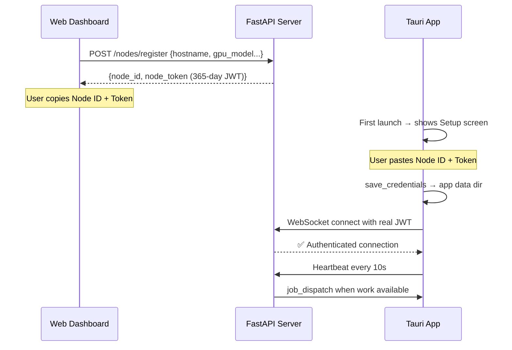

# CampuGrid — Gap Fill Walkthrough

## What Was Done

After auditing the full codebase against the original 7-phase design (`chat.md`, `chat2.md`, and all phase plans), I identified and fixed **6 major gaps** across 15 files. Here's what was built:

---

## Sprint 1: Server Foundation — Billing, Gamification, Enhanced APIs

### [NEW] [billing_service.py](file:///home/samito/Downloads/ECLIPSE/server/app/services/billing_service.py)
Production billing engine that:
- Calculates chunk costs using real GPU benchmarks, sync mode multipliers, and dynamic pricing
- Records billing entries and updates node earnings + job costs atomically
- Aggregates GPU hours and spend for the dashboard

### [NEW] [gamification.py](file:///home/samito/Downloads/ECLIPSE/server/app/utils/gamification.py)
Rank tier system matching Phase 6 design:
- 5 tiers: 💻 Node → ⚡ Cluster → 🏢 Datacenter → 🌩️ Supercomputer → 🌌 Hyperscaler
- Contribution streak tracking with break detection

### [REWRITE] [nodes.py](file:///home/samito/Downloads/ECLIPSE/server/app/api/v1/nodes.py)
Added 4 new endpoints to the existing file:
- `POST /nodes/register` now returns a **365-day JWT token** for the Tauri daemon
- `POST /nodes/me/{node_id}/token` — regenerate a node JWT
- `GET /nodes/me/{node_id}/history` — job history for a specific node
- `GET /nodes/leaderboard` — campus rankings with tier badges
- `GET /nodes/stats` now uses real billing data instead of `0.0`

---

## Sprint 2: Web Contributor Pages

### [NEW] [/contributor](file:///home/samito/Downloads/ECLIPSE/web/src/app/(app)/contributor/page.tsx)
Node management dashboard showing:
- Earnings summary cards (total earned, GPU hours, current rate)
- All registered nodes with status indicators, hardware specs, earnings
- "Get Auth Token" button that generates a fresh JWT inline

### [NEW] [/contributor/register](file:///home/samito/Downloads/ECLIPSE/web/src/app/(app)/contributor/register/page.tsx)
Node registration form with:
- Hardware details (GPU model dropdown, CPU cores, RAM, CUDA version)
- On success: displays Node ID + JWT token with copy buttons
- Clear "Next Steps" instructions for pasting into Tauri

### [NEW] [/contributor/leaderboard](file:///home/samito/Downloads/ECLIPSE/web/src/app/(app)/contributor/leaderboard/page.tsx)
Campus leaderboard with:
- Rank medals (🥇🥈🥉), tier badges, reliability stars, streak flames
- "You" tag highlighting the current user's position
- Real-time 30s refresh

### [MODIFIED] [Sidebar.tsx](file:///home/samito/Downloads/ECLIPSE/web/src/components/Sidebar.tsx)
Added `Contributor` and `Leaderboard` navigation items with Cpu/Trophy icons.

### [MODIFIED] [dashboard/page.tsx](file:///home/samito/Downloads/ECLIPSE/web/src/app/(app)/dashboard/page.tsx)
GPU Hours and Earned cards now pull real data from `/billing/earnings` API.

### [MODIFIED] [submit/page.tsx](file:///home/samito/Downloads/ECLIPSE/web/src/app/(app)/submit/page.tsx)
Fixed framer-motion + react-dropzone type conflict by separating wrappers.

### [REWRITE] [api.ts](file:///home/samito/Downloads/ECLIPSE/web/src/lib/api.ts)
Extended with 7 new methods: `getMyNodes`, `registerNode`, `regenerateNodeToken`, `getNodeHistory`, `getClusterStats`, `getLeaderboard`, `getEarnings`, `getBillingHistory`.

---

## Sprint 3 & 4: Tauri Auth & History

### [NEW] [SetupView.tsx](file:///home/samito/Downloads/ECLIPSE/daemon/src/SetupView.tsx)
Login screen shown on first launch:
- Instructions on how to get credentials from the web dashboard
- Node ID + Auth Token input fields
- Validates and saves credentials before connecting

### [REWRITE] [App.tsx](file:///home/samito/Downloads/ECLIPSE/daemon/src/App.tsx)
- Checks `has_credentials` on startup — shows Setup or Dashboard
- Added History tab placeholder
- `handleSetupComplete` triggers WebSocket reconnect with real credentials

### [REWRITE] [lib.rs](file:///home/samito/Downloads/ECLIPSE/daemon/src-tauri/src/lib.rs)
New Tauri commands:
- `has_credentials` — checks if credentials files exist
- `save_credentials` — persists Node ID + JWT to app data directory
- `restart_websocket` — reconnects with new credentials after setup
- WebSocket only starts if credentials exist (no more blind connections)

### [MODIFIED] [websocket.rs](file:///home/samito/Downloads/ECLIPSE/daemon/src-tauri/src/websocket.rs)
Now accepts and uses real JWT auth token instead of hardcoded `internal_node`.

---

## Build Verification

| Component | Command | Result |
|-----------|---------|--------|
| **Web App** | `npm run build` | ✅ All 12 routes compiled (including 3 new `/contributor/*`) |
| **Server** | `python -m py_compile` | ✅ All 3 new files compile clean |
| **Daemon** | `npx tsc --noEmit` | ✅ Zero TypeScript errors |

---

## The Complete Contributor Flow (Now Working)

