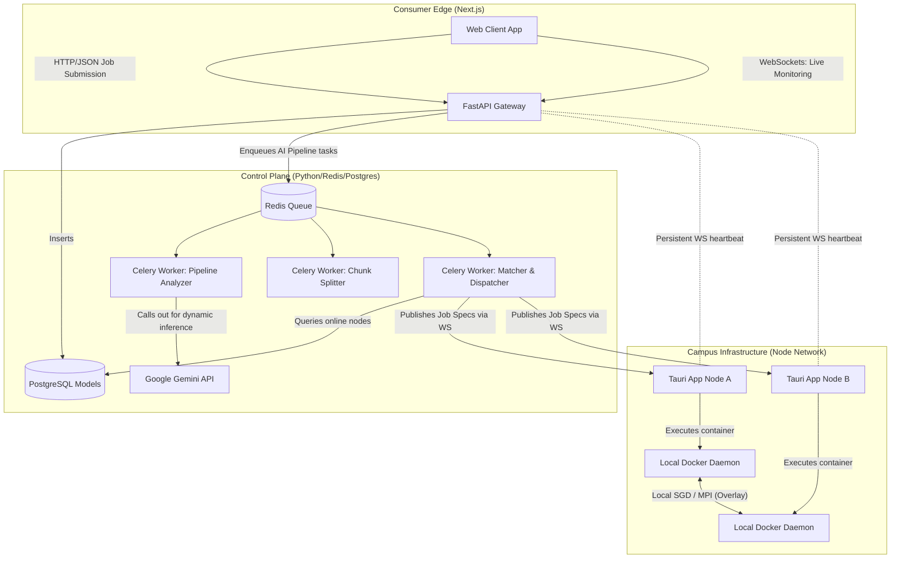
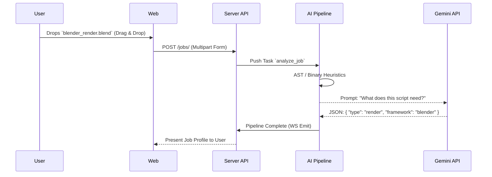
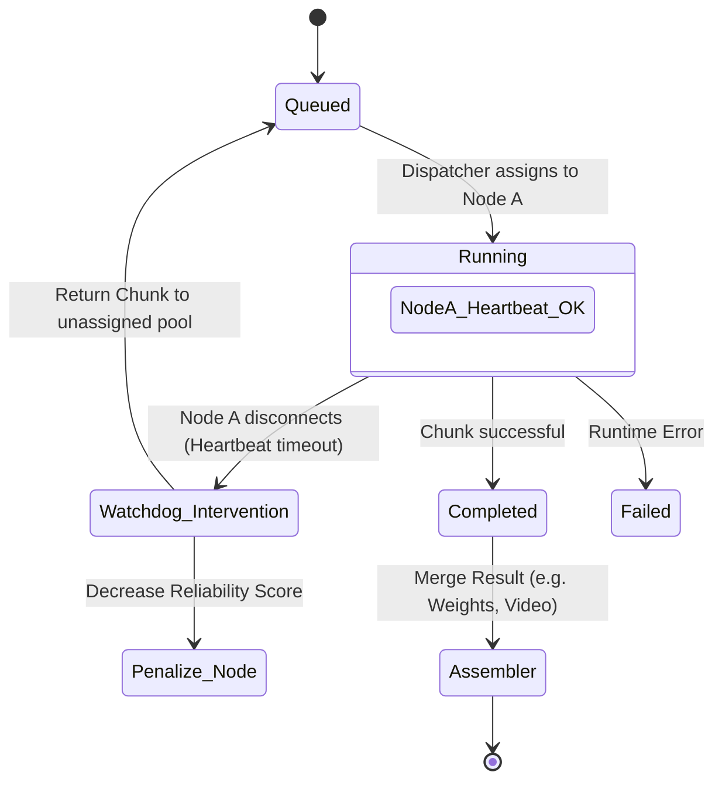

# CampuGrid Architecture

This document outlines the distributed architecture of the CampuGrid platform, highlighting the interactions between the Next.js Consumer Web App, the FastAPI/Celery Orchestration Layer, and the Tauri Contributor Nodes.

## System Topology 

## Deep Dive: The AI Pipeline

The AI pipeline entirely bypasses manual configuration by the user.

## Fault Tolerance: The Watchdog

Because CampuGrid runs on untrusted, consumer hardware on university Wi-Fi, it relies on a Watchdog process to ensure tasks complete.

